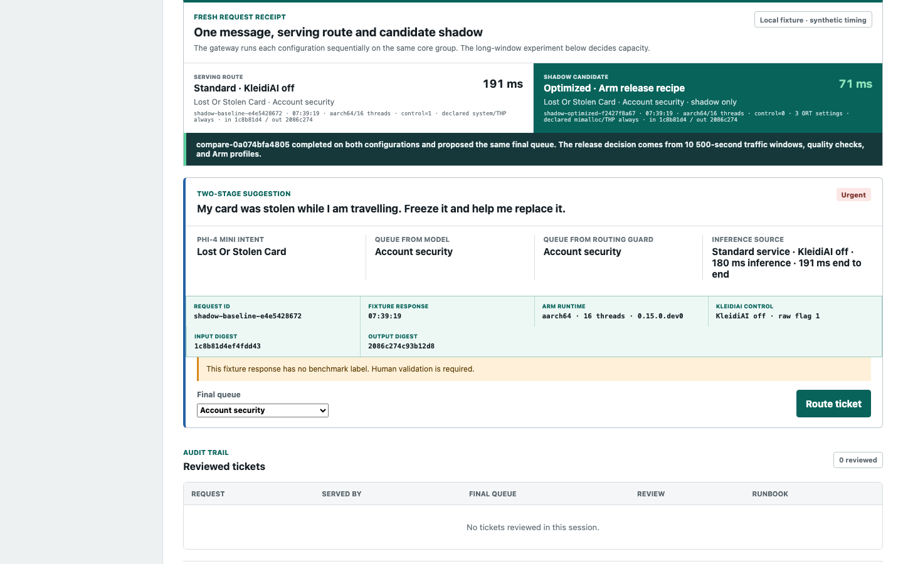
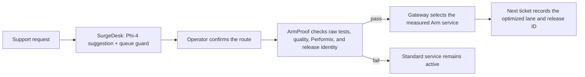

# SurgeDesk

### Banking-support triage on a measured Arm cloud AI service, with ArmProof as its release gate

SurgeDesk is a banking-support triage application built around measurements
from a CPU-only AWS Graviton4 server. Phi-4 Mini suggests the intent, SurgeDesk selects the matching support
procedure, and a person chooses the final queue.

The application starts on its standard service. ArmProof checks the measured
performance, output quality and Arm execution before SurgeDesk can switch its
connected gateway to the KleidiAI-optimized service. Each ticket records which
service handled it.

**Challenge track:** Cloud AI, Arm Create AI Optimization Challenge.



_Local integration-test capture. Synthetic fixture timing is labeled in the
interface; the capacity claims come from the archived Graviton4 experiments,
and the recorded demo uses the real Graviton endpoints._

## Measured Optimization

SurgeDesk was optimized in three stages. Each stage is evaluated against the
comparison shown below.

| Stage | Technical change | Measured result |
|---|---|---:|
| Model footprint | Migrate Phi-4 Mini from BF16 to CPU INT4 | 35.92% smaller files; 43.09% lower peak PSS before KleidiAI |
| Arm compute | Enable ONNX Runtime's KleidiAI I8MM path on the same INT4 service | At least 2.0x sustained capacity; 67.35% of Performix function samples in `kai_*` |
| Graviton runtime | Keep the I8MM path and tune ONNX Runtime thread scheduling, mimalloc, and transparent huge pages | 5/5 passes at 0.62 requests/s versus 0/5 for KleidiAI alone; 44.98% lower median p95 |

The final stage raises the verified traffic floor from 0.56 to 0.62 requests per
second, or from 2,016 to 2,232 offered messages per hour, an additional 10.71%.
At 0.62 requests per second, the full runtime
recipe passed all five sustained windows. The allocator-and-huge-page variant
failed all five, so the released recipe retains the measured thread settings.

### Arm Compute Result

The KleidiAI-optimized service handled **at least twice the sustained traffic**
on the same 16-core `c8g.4xlarge`. A test window passes only when 95% of requests
finish within ten seconds, no request errors occur, and at least 95% of the
offered traffic is completed.

| Preregistered confirmation | Rate | Five 500-second windows |
|---|---:|---:|
| KleidiAI disabled control | 0.28 requests/s | 5 failed |
| KleidiAI enabled treatment | 0.56 requests/s | 5 passed |

The standard service fails at 0.28 requests per second, so its sustainable rate
is below 0.28. The optimized service passes at 0.56, so its sustainable rate is
at least 0.56. That establishes the conservative lower bound
`0.56 / 0.28 = at least 2.0x`.

The two service configurations use the same Phi-4 Mini INT4 files, ONNX Runtime
build, 16 threads, workload, server and response-time rule; their only changed
runtime setting enables KleidiAI. The final capacity test intentionally offers
each service its frozen boundary rate, 0.28 and 0.56 requests per second, to
establish the conservative lower bound. Git commit `ab22cc0` contains the exact final plan, and its commit time
precedes the instance-launch time recorded in the experiment metadata. That is
a reproducible chronology check, not independent AWS attestation.

Earlier tests located the standard service between 0.24 and 0.28 requests per
second. The optimized service passed at 0.56, while 0.60 produced mixed results.
Those observations selected the two final rates. EXP-2026-014 then tested only
those committed rates and required every response to carry the complete model,
runtime, Arm64, thread and treatment identity.

For the compute release, ArmProof checks:

- 2,100 raw request outcomes from the ten capacity windows;
- 1,540 raw model outputs, 770 from each lane;
- that accuracy and class-balanced F1 change by less than one percentage point;
- that at least 99% of model outputs use the required JSON format; and
- four hash-locked deployment measurement files used to recalculate footprint
  percentages and raw-repetition timing medians;
- Arm Performix profiles with zero KleidiAI functions in the control and at
  least 50% KleidiAI function samples in the optimized service.

For the final runtime recipe, it additionally verifies 130 checksum-bound files
across three Graviton experiments: the paired sustained comparison, a four-way
short treatment screen, and the failed sustained simplification. It re-derives
all 31 stored window summaries from 3,678 raw rows. Output equivalence is checked
on the 2,790 sustained rows covering 186 request cases. The archived configs
bind the rate, SLO, KleidiAI control, 16 threads, exact ONNX Runtime session
options and declared allocator; per-window host readbacks verify huge-page state
and restoration. The archives do not contain `/proc/<pid>/maps`, so ArmProof
does not claim observed allocator loading.

An exploratory supporting test recalculates five raw repetitions for each of
four fixed input shapes and found 1.72x to 2.59x faster direct inference. The
BF16-to-INT4 migration measured 35.92% smaller model files and 43.09% lower peak
proportional set size (PSS) before KleidiAI was enabled. The complete
KleidiAI-enabled INT4 stack measured 55.34% lower peak PSS and 59.66% lower
time-weighted PSS than BF16. Those whole-stack footprint results are kept
separate from the matched KleidiAI-only capacity comparison.
ArmProof recalculates the size and memory percentages from locked aggregate
measurements and the timing medians from raw repetitions in EXP-2026-002. The
report is generated from those locked measurements and raw repetitions.

## Product Workflow



The five-queue routing guard was built on 2,310 BANKING77 examples and evaluated
on a disjoint 770-message development holdout. It raised routing accuracy from
74.42% for direct model mapping to 86.75%. A person still selects every final
queue, and this routing feature is separate from the Arm performance result.

## What Verification Checks

The verification command checks the archive ledgers, re-derives end-to-end capacity and quality from
raw rows, parses native Arm Performix exports, binds the observed treatment
identities to `confirmed-contract.json`, and writes:

- `decision.json`
- `comparison.json`
- `summary.json`
- `verification.json`
- an offline HTML report

Exit `0` approves every required claim. Exit `2` means at least one required
claim failed or remained unknown. Exit `1` means the evidence or configuration
was invalid.

## Verify In Five Minutes

The shortest evaluation path is [`docs/VALIDATION.md`](docs/VALIDATION.md). To
recompute the release directly:

```bash
git clone https://github.com/QasimKhan5x/ArmProof.git
cd ArmProof
python3.12 -m venv .venv
.venv/bin/python -m pip install -e .
.venv/bin/armproof ci examples/armproof-reference/armproof.json
```

Expected result: exit `0` after 10 compute, quality, identity, and Arm
attribution claims plus five sustained-runtime release conditions pass.

## Run The Product

```bash
python3.12 scripts/build_surgedesk.py --verify
python3.12 scripts/serve_surgedesk.py --port 8765
```

Open <http://127.0.0.1:8765/surgedesk/>. This local path uses the checked-in
evidence and recorded BANKING77 examples, so the workflow can be inspected
without AWS credentials or model downloads.

The three views have stable URLs:

- `#triage`: support workflow and human routing decision
- `#evidence`: capacity audit and raw outcomes
- `#release`: release status, optimization summary, Arm Performix evidence, and
  connected traffic control when both Arm services are available

The connected deployment uses a real serving-plus-shadow comparison before the
route cutover and routes subsequent requests through the approved Graviton
service. Setup commands and expected outputs are in
[`docs/LIVE_DEPLOYMENT.md`](docs/LIVE_DEPLOYMENT.md).

## Reuse ArmProof

ArmProof provides:

- versioned performance, quality and Arm-execution contracts;
- a fixed-rate HTTP load generator;
- hash-locked raw request and raw model-output verification;
- a verifier for sustained runtime-treatment archives and failed candidates;
- native Arm Performix Code Hotspots parsing;
- model, runtime, workload and environment identity binding;
- an offline report and machine-readable receipt;
- a GitHub Action for pull-request release gates;
- a blocked-by-default starter generated by `armproof init`; and
- a public evidence-adapter interface for other runtimes.

Generate a starter for another bounded HTTP classification service:

```bash
.venv/bin/armproof init \
  --endpoint http://127.0.0.1:8000/infer \
  --output my-arm-service \
  --action-commit REPLACE_WITH_THE_REVIEWED_40_CHARACTER_RELEASE_COMMIT
cd my-arm-service
../.venv/bin/armproof ci armproof.json
```

The 17-file starter includes exact protocol, identity and profiler-manifest
templates as well as the workloads, collection plan and GitHub Action. The
`--action-commit` value pins that Action immutably in the generated workflow.
Its binding helper recalculates workload, model, runtime, environment, service
command, profiler-report, contract and workflow digests after placeholders are replaced.
The initial check fails until the developer collects real request rows, profiler
output and observed identities. After collection,
`armproof seal armproof.json` creates the deterministic checksum ledger and
`armproof ci armproof.json` evaluates the contract. The executable reference
shape is in [`examples/http-slo/`](examples/http-slo/). The tested
[`examples/llama-cpp-http-slo/`](examples/llama-cpp-http-slo/) adapter confirms
endpoint compatibility; it does not claim a llama.cpp performance result.

Use ArmProof in GitHub Actions:

```yaml
- uses: actions/setup-python@5fda3b95a4ea91299a34e894583c3862153e4b97 # v7
  with:
    python-version: "3.12"
- uses: QasimKhan5x/ArmProof@REPLACE_WITH_THE_REVIEWED_40_CHARACTER_RELEASE_COMMIT
  with:
    config: armproof.json
    contract-sha256: REPLACE_WITH_THE_PROTECTED_CONTRACT_DIGEST
```

Protect the workflow and contract with `CODEOWNERS` and branch rules. The
Action checks the contract digest before reading evidence.

## Arm Optimization Details

- **Hardware:** AWS Graviton4, `c8g.4xlarge`, 16 Arm Neoverse V2 cores
- **Model:** `microsoft/Phi-4-mini-instruct-onnx`, pinned revision, CPU INT4
- **Runtime:** pinned ONNX Runtime and ONNX Runtime GenAI Arm64 builds
- **Arm library:** KleidiAI v1.20 through ONNX Runtime
- **Control:** `mlas.disable_kleidiai=1`
- **Treatment:** `mlas.disable_kleidiai=0`
- **Final runtime recipe:** KleidiAI enabled; ONNX Runtime dynamic block base
  `4`, spin backoff `8`, spin duration `1000 us`; declared mimalloc preload;
  transparent huge pages observed as `always`
- **Profiler:** Arm Performix 1.20 Code Hotspots, with Linux perf as a separate cycle view
- **Workload:** frozen BANKING77 quality and mixed traffic inputs
- **SLO:** p95 at or below 10 seconds, zero errors, at least 95% delivery

The one-variable KleidiAI comparison establishes the Arm compute effect. The
later runtime experiment deliberately begins with KleidiAI enabled and tunes
the whole Graviton service; its result is not presented as an I8MM-only gain.
The Performix release gate uses function samples in their native units. Linux
perf cycle attribution is supporting evidence and is not numerically compared
with the Performix percentage.

## Test The Project

```bash
make check
npm ci
npx playwright install --with-deps chromium
npm run test:logic
npm run test:ui
```

Tests cover policy evaluation, archive derivation, raw-output quality checks,
native Performix parsing, runtime-artifact and IMDSv2 deployment checks,
per-request drift rejection, a real localhost control-to-treatment HTTP flow,
the SurgeDesk workflow, the offline report and responsive layouts down to 320
pixels.

## Repository Map

- [Documentation map](docs/README.md): entry point for users and maintainers
- [Validation guide](docs/VALIDATION.md): fastest reproducible evaluation path
- [Technical evidence](docs/EVIDENCE.md): claim-to-artifact map
- [Live deployment](docs/LIVE_DEPLOYMENT.md): matched Graviton service setup
- [`examples/armproof-reference/`](examples/armproof-reference/): release contract and config
- [`ops/experiments/`](ops/experiments/): frozen plans, including the public capacity and Performix preregistrations
- [`ops/evidence/`](ops/evidence/): accepted and rejected evidence history
- [`examples/phi4-graviton/`](examples/phi4-graviton/): pinned Arm deployment
- [`docs/PERFORMIX.md`](docs/PERFORMIX.md): native Performix collection and interpretation

## Scope And Provenance

ArmProof verifies a declared contract for a pinned model, workload, runtime and
machine. Repository SHA-256 ledgers detect changes after collection; they are
integrity controls rather than independent attestation of the original AWS
host. The live service verifies the pinned wheel ledger, reads its instance type
from AWS IMDSv2, and reports actual CPU affinity. The gateway checks those values
and content-derived model identities before promotion and on every optimized
response; ticket receipts also bind the exact input and raw model output by
SHA-256. This is deployment validation rather than hardware-backed remote
attestation, and it assumes the operator controls the host. The checksum-pinned
Arm64 runtime bundle used by the connected SurgeDesk recipe is a separate
deployment artifact published with the earlier `v0.9.0` release; ArmProof itself
is versioned independently. Model weights still download from their pinned
upstream revision.

SurgeDesk and ArmProof were created and meaningfully developed from July 29
through August 7, 2026, during the challenge period. The Git history contains
the source changes, published capacity and profiler plans, archived runtime
treatment plans, experiment records, and evidence used by the release.

The project is MIT licensed. BANKING77 is used under CC BY 4.0 and credited in
[`THIRD_PARTY_NOTICES.md`](THIRD_PARTY_NOTICES.md). Model weights are downloaded
from their original source and are not redistributed.
