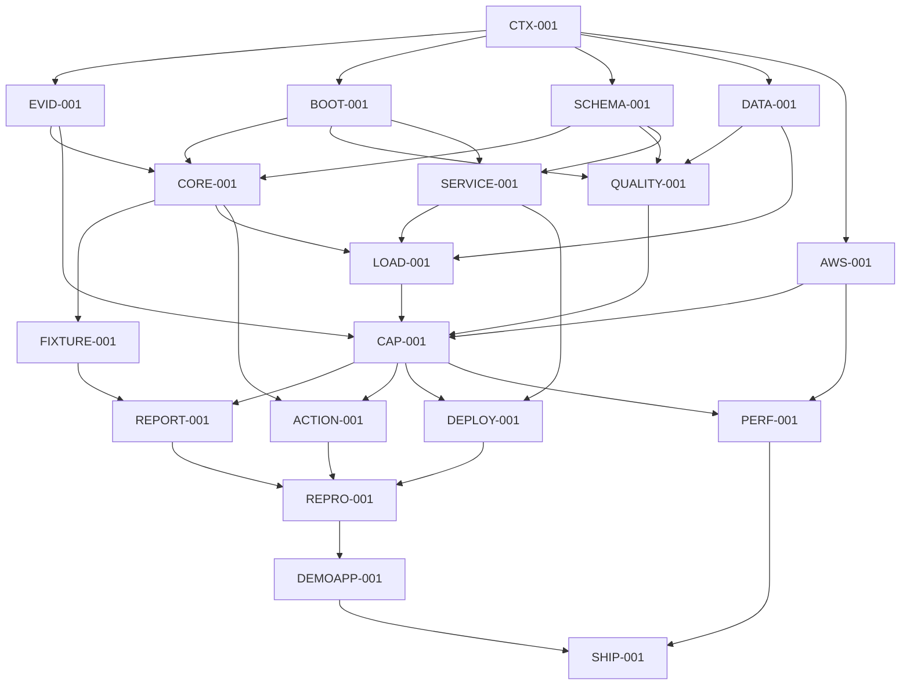

# ArmProof Implementation Plan

Status: **APPROVED FOR IMPLEMENTATION**

## Dependency Graph

Exact dependencies and status live in `ops/work-items.json`.

## Phase 0: Foundation

- Import and hash existing evidence.
- Establish verified Python build/test/lint commands.
- Freeze contract, evidence and claim schemas.
- Select and license the larger reference workload.
- Update the AWS lifecycle for ArmProof.

Checkpoint: existing claims validate from imported evidence without AWS.

## Phase 1: Fail-Closed Vertical Slice

- Implement schema loading and identity validation.
- Implement claim dependencies, causal scopes and stable reason codes.
- Generate one decision and report from fixture/imported evidence.
- Add tamper, missing-evidence and disabled-KleidiAI tests.

Checkpoint: CLI, decision artifact and fixture report agree.

## Phase 2: Real Service Harness

- Implement common HTTP treatment adapters.
- Implement deterministic workload replay and quality evaluation.
- Collect request metrics, RSS/PSS and separate Arm attribution.
- Measure normal collection overhead.

Checkpoint: lifecycle and negative paths pass on a free/local environment;
Arm-only attribution smoke runs on available Arm64 hardware.

## Phase 3: Fixed-SLO Capacity Gate

- Preregister the exact experiment.
- Run one bounded `c8g.4xlarge` session.
- Evaluate without changing thresholds.

Checkpoint: `CAPACITY_VALIDATION.md` returns pass before polished product work
becomes the critical path. Failure returns to the owner; no weaker pivot is
automatic.

## Phase 4: Community Product

Parallel lanes after schemas and accepted capacity evidence:

- interactive report and browser tests;
- GitHub Action and PR check;
- exact deployment manifest;
- adapter/workload authoring docs.

Checkpoint: one YAML and one command drive a useful passing or failing PR
decision.

## Phase 5: Reproduction And Submission

- Clean-room Graviton replay.
- Matched Arm Performix causal characterization and native export validation.
- Evidence-backed SurgeDesk application workflow.
- Security, licensing, accessibility and secret checks.
- Demo, offline fallback and Devpost traceability.

Checkpoint: every public claim maps to immutable evidence.

## Execution Rules

- Implement S/M-sized tasks and verify each increment.
- Do not build report polish before the capacity gate.
- UI may develop against frozen fixtures in parallel but cannot claim accepted
  metrics before evidence exists.
- Paid sessions execute only a preregistered task.
